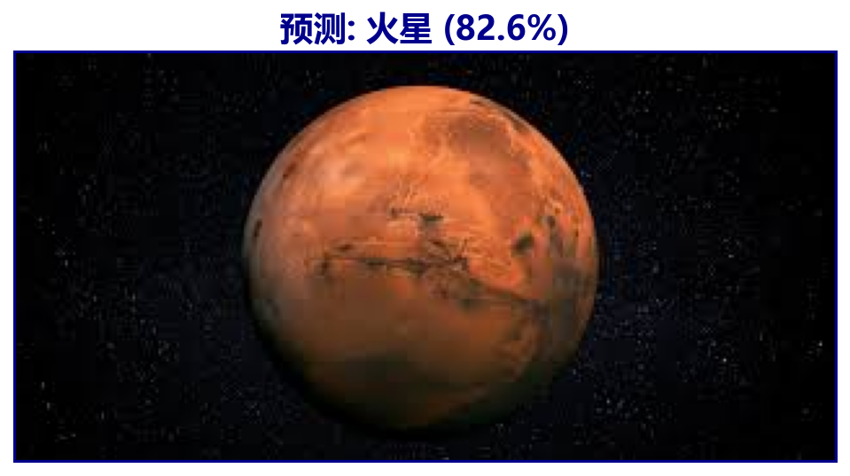
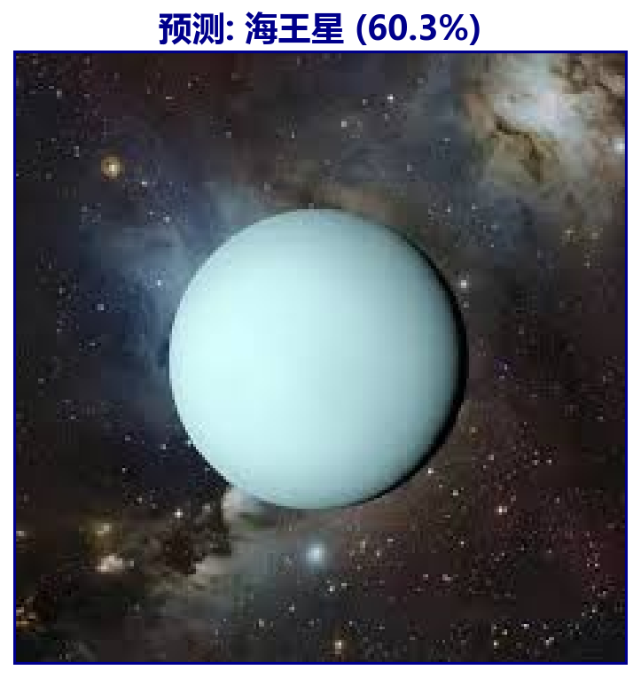
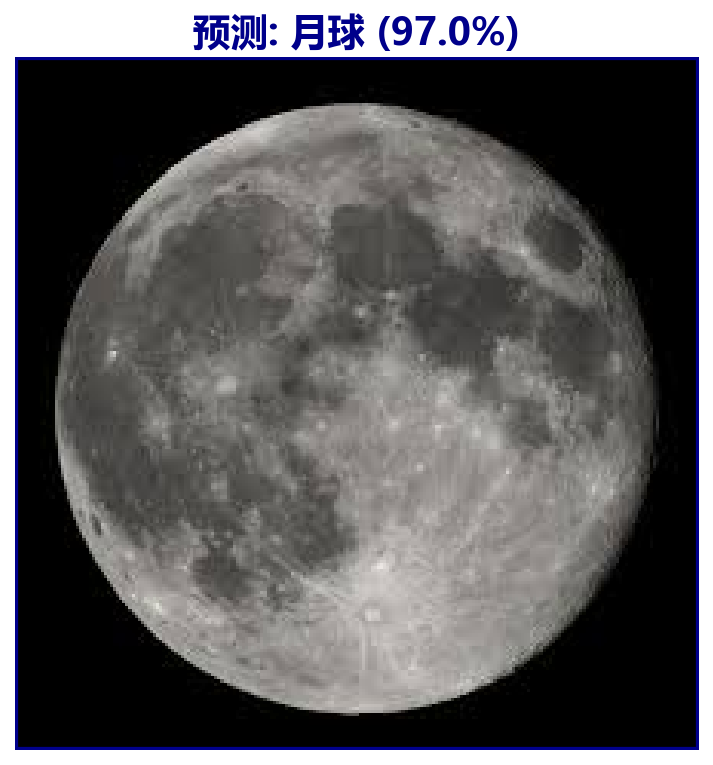
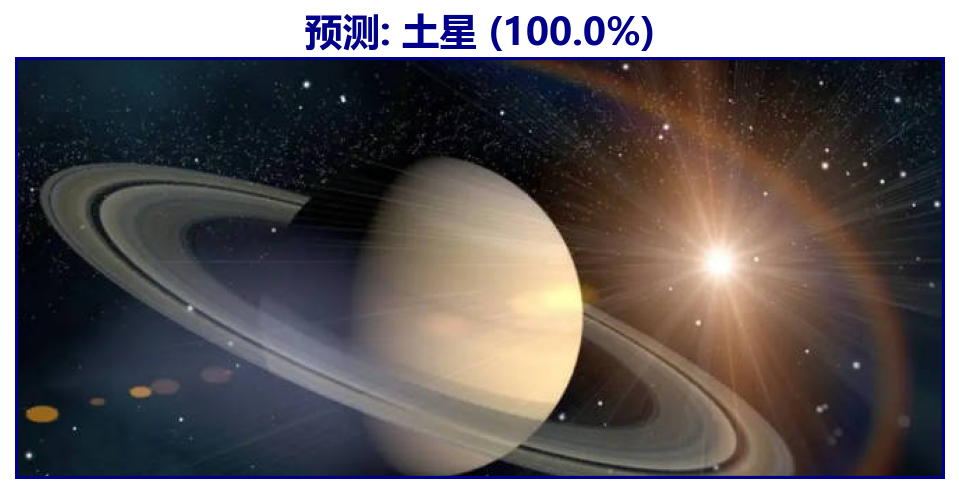
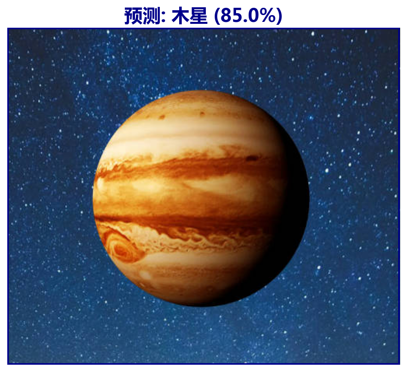
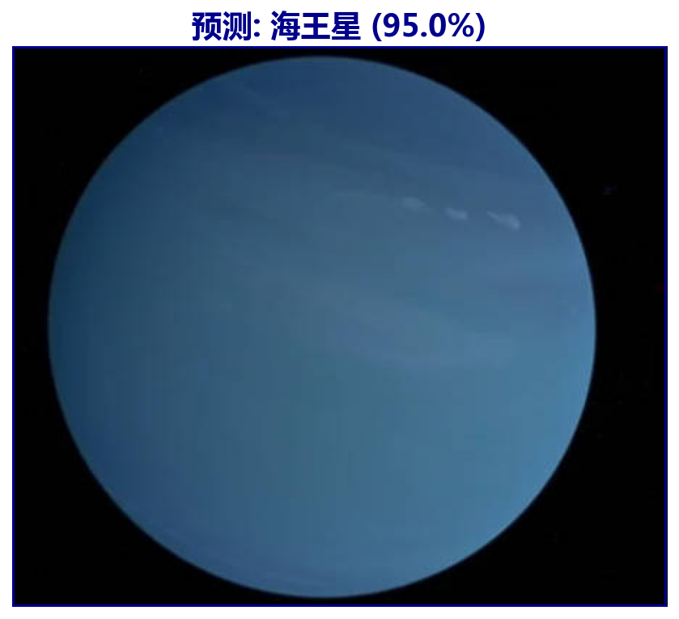
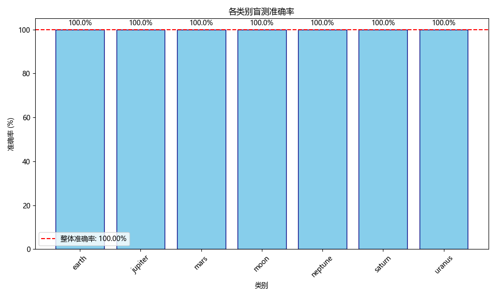

# 🌌 天体图像分类项目|Celestial Image Classifier Program|딥러닝 기반 행성 이미지 분류 프로그램

基于 PyTorch 的天体图像分类系统，支持 ResNet50、EfficientNet-B3 和模型集成

A PyTorch-based celestial object image classification system supporting ResNet50, EfficientNet-B3, and model ensembles

PyTorch 기반의 천체 이미지 분류 시스템으로, ResNet50, EfficientNet-B3 및 앙상블 모델을 지원합니다

实验结果表明模型对七个行星的分类达到了100%的正确率，并且支持自己所给出的行星图片，由于本实验的数据集来源于Nasa公开的网站获取，如果未来能够获取更多质量较好的行星图片，该模型能够自动识别更多的天体，作为一个对宇宙探索的好奇者，希望该项目能够对宇宙领域带来一定的贡献，也欢迎各位对该项目进行完善和改进，有任何问题可以邮件联系我，email: xzq@knu.ac.kr.

The experimental results show that the model achieved 100% accuracy in classifying the seven planets and is capable of supporting the planetary images it was given. Since the dataset used in this experiment was obtained from NASA's public website, the model has the potential to automatically recognize more celestial bodies if higher-quality planetary images become available in the future. As someone curious about space exploration, I hope this project can contribute to the field of astronomy. You are welcome to further improve and refine this project. If you have any questions, feel free to contact me via email: xzq@knu.ac.kr.

실험 결과, 본 모델은 일곱 개 행성에 대한 분류에서 100%의 정확도를 달성했으며, 제공된 행성 이미지를 정확히 인식할 수 있었습니다. 본 실험에 사용된 데이터셋은 NASA 공개 웹사이트에서 수집한 것으로, 향후 더 높은 품질의 행성 이미지가 확보된다면 이 모델은 더 많은 천체를 자동으로 인식할 수 있을 것입니다. 우주 탐사에 대한 호기심을 가진 사람으로서 이 프로젝트가 우주 분야에 작은 기여라도 하기를 바랍니다. 이 프로젝트를 개선하거나 발전시키는 데 관심 있는 분들의 참여를 환영합니다. 문의사항이 있으시면 이메일(xzq@knu.ac.kr)로 연락해 주세요.

## 🔍 实验结果|Prediction Results Preview|실험 결과

<table>
  <tr>
    <td></td>
    <td></td>
    <td></td>
    <td></td>
  </tr>
  <tr>
    <td></td>
    <td></td>
    <td></td>
    <td></td>
  </tr>
</table>

## 💻实验环境|Experimental Environment|실험 환경

Python 3.9  

torch==2.6.0+cu126

requirements.txt (pip)

## 🌟训练步骤|Training Steps|훈련 단계

### 数据准备|Data Preparation|데이터 준비

data/  
└── input/  
├── earth/   
├── jupiter/   
├── mars/   
├── moon/  
├── neptune/  
├── saturn/  
└── uranus/

数据集应该如上所示放在data/input目录下

The dataset should be placed in the `data/input` directory as shown above.

데이터셋은 위에서 보여준 것처럼 `data/input` 디렉토리에 위치해야 합니다

## 👉1️⃣datapre.py

该代码会自动生成适合训练的数据集（70% 训练，15% 验证，15% 测试）

This script will automatically generate a dataset suitable for training (70% for training, 15% for validation, and 15% for testing)

이 코드는 학습에 적합한 데이터셋을 자동으로 생성합니다 (훈련용 70%, 검증용 15%, 테스트용 15%)

celestial_dataset/
├── train/
│   ├── earth/
│   ├── jupiter/
│   ├── mars/
│   ├── moon/
│   ├── neptune/
│   ├── saturn/
│   └── uranus/
│
├── val/
│   ├── earth/
│   ├── jupiter/
│   ├── mars/
│   ├── moon/
│   ├── neptune/
│   ├── saturn/
│   └── uranus/
│
└── test/
    ├── earth/
    ├── jupiter/
    ├── mars/
    ├── moon/
    ├── neptune/
    ├── saturn/
    └── uranus/

## 👉2️⃣运行improved_training.py

运行后模型将开始进行训练

After running the script, the model will begin training

코드를 실행하면 모델이 학습을 시작합니다

## 👉3️⃣运行evaluate_model.py

进行模型评价阶段|Model evaluation phase|모델 평가 단계

| 文件名\|File name\|파일 이름                  | 内容\|Conment\|내용     |
| -------------------------------------- | ------------------- |
| `classification_report.csv`            | 每类的准确率、召回率、F1 分数等指标 |
| `confusion_matrix.png`                 | 标准混淆矩阵图             |
| `normalized_confusion_matrix.png`      | 归一化混淆矩阵             |
| `class_accuracy.png`                   | 每个类别的准确率条形图         |
| `prediction_visualization.png`         | 前10张图像的预测结果可视化      |
| `misclassified_samples.png`            | 错误分类的样本（如有）         |
| `feature_activation_visualization.png` | Grad-CAM 风格的特征激活图   |

## 👉4️⃣generate_visual_predictions.py(optional)

生成图像分类模型的预测可视化结果图

Generate prediction visualization for the image classification model

이미지 분류 모델의 예측 결과 시각화 생성

## 👉5️⃣blind_test_validation.py(optional)

验证图像分类模型是否真的学会了图像内容，而不是记住文件名或路径模式

Verify whether the image classification model has truly learned the image content, rather than memorizing file names or path patterns

이미지 분류 모델이 파일 이름이나 경로 패턴을 외운 것이 아니라 실제로 이미지 내용을 학습했는지 검증

## 👉6️⃣predict_my_images.py(optional)

对本地文件夹中的所有图片进行批量预测，并生成结果图和汇总文件。
(想要进行预测的图片可以保存同目录下my_images文件中)

Perform batch prediction on all images in the local folder and generate result visualizations and a summary file.  
(The images to be predicted can be saved in the `my_images` folder under the same directory.)

로컬 폴더에 있는 모든 이미지에 대해 배치 예측을 수행하고, 결과 시각화 및 요약 파일을 생성합니다.  
(예측하려는 이미지는 동일 디렉토리의 `my_images` 폴더에 저장할 수 있습니다.)
